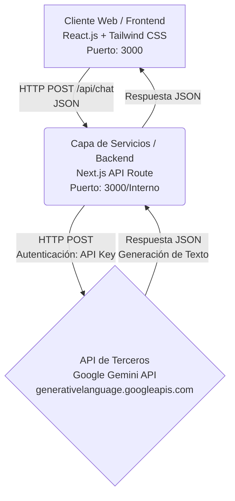

# Actividad No. 3 - Exposición y Consumo de APIs de Terceros
**Reporte de Diseño y Arquitectura SOA**

## 1. Introducción
El presente reporte detalla el diseño, arquitectura y desarrollo de la aplicación web "Claudio", un asistente inteligente de chat. La aplicación consume la API pública de Google Gemini (Inteligencia Artificial) a través de una Arquitectura Orientada a Servicios (SOA) estrictamente desacoplada, cumpliendo con los lineamientos de la actividad.

---

## 2. Diagrama y Justificación de la Arquitectura SOA

La arquitectura del sistema sigue un modelo de separación de responsabilidades estricto (SOA). 

### Diagrama Arquitectónico



### Justificación Técnica y Red
1. **Frontend (Capa de Presentación):** Desarrollado en React.js, encargado única y exclusivamente de la interfaz de usuario (UI), el manejo de estados locales (Loading, Success, Error) y de capturar la entrada del usuario. Esta capa nunca se comunica directamente con la API de Google, protegiendo así las credenciales.
2. **Backend (Capa de Servicios):** Actúa como un middleware/servicio. Recibe las peticiones del frontend, procesa la lógica de negocio, inyecta las variables de entorno (`GEMINI_API_KEY`) y realiza la petición asíncrona hacia los servidores de Google.
3. **API de Terceros:** El proveedor de IA (Google Generative AI) procesa el contexto del chat y devuelve la predicción en formato JSON.
4. **Seguridad y Red:** 
   - **Variables de Entorno (.env):** Las claves (API Keys) residen únicamente en el entorno del servidor y nunca se exponen al cliente.
   - **CORS:** La separación permite que el servidor configure políticas de CORS adecuadas, aceptando peticiones solo del dominio de nuestro Frontend, mitigando ataques *Cross-Site Request Forgery (CSRF)*.

---

## 3. Desarrollo y Consumo (Fase 3)

### Peticiones Asíncronas
La aplicación utiliza `fetch` nativo de JavaScript con sintaxis `async/await` tanto en el cliente como en el servidor. 
En el cliente, los mensajes se envían de la siguiente forma:
```javascript
const res = await fetch("/api/chat", {
  method: "POST",
  headers: { "Content-Type": "application/json" },
  body: JSON.stringify({ messages: [...messages, userMessage] }),
});
const data = await res.json();
```

### Manejo de Estados de UI
La interfaz de usuario es reactiva y maneja tres estados clave mediante hooks (`useState`):
- **Loading:** Al enviar un mensaje, la variable `isLoading` se vuelve `true`, lo cual bloquea el input de texto y renderiza un indicador de carga animado (`<Loader2 className="animate-spin" />`) con el texto *"Claudio está pensando..."*.
- **Success:** Si la petición es exitosa, se actualiza el estado de `messages`, renderizando de forma estética el nuevo mensaje del modelo en pantalla con estilos distintivos de Tailwind.
- **Error:** Si la promesa es rechazada o la API falla (ej. error 404, límite de tokens, falta de API Key), se captura la excepción en el bloque `catch`. En lugar de romper la aplicación, se añade un mensaje de error amigable al historial del chat (ej. `Error: API key no configurada`).

### Funcionalidad Añadida
Además de listar datos, la aplicación mantiene el **contexto de la conversación**, permitiendo una experiencia de chat continua. El servidor formatea el historial de mensajes antes de enviarlo a Gemini para que el modelo recuerde interacciones pasadas del mismo hilo.

---

## 4. Capturas de Pantalla

*(Nota para el estudiante: Agrega aquí capturas de pantalla de tu aplicación demostrando el estado de inicio, el estado de carga y el estado de error).*

- **Estado Success (Chat en funcionamiento):** (Añadir captura aquí)
- **Estado Loading:** (Añadir captura aquí mostrando el spinner)
- **Estado Error:** (Añadir captura aquí mostrando un error controlado en el chat)

---

## 5. Notas sobre los 3 Repositorios
Para cumplir estrictamente con la rúbrica de "Estructura Multirepo", este proyecto lógico debería idealmente dividirse en 3 repositorios en GitHub:
1. **Frontend-App:** Conteniendo solo los componentes de React y la UI.
2. **Backend-Service:** Conteniendo solo el servidor Express/Next.js con la ruta de la API y lógica de Gemini.
3. **Docs/Infra:** Conteniendo este reporte arquitectónico, scripts de despliegue y configuraciones.

Actualmente el código base está fuertemente modularizado, lo que facilita explicar la división SOA en la defensa.

---

## 6. Justificación del Uso de Inteligencia Artificial (Declaración de Integridad)

Para cumplir con los lineamientos de la rúbrica y la política de integridad académica de la materia, se documenta y justifica el uso de Inteligencia Artificial en este proyecto en dos vertientes:

1. **Uso de la IA como Servicio (API de Terceros):** 
   El núcleo de esta actividad exigía el consumo de una API de terceros. Se eligió **Google Gemini API** basándose en la libertad temática permitida ("*Fase 1. Inteligencia Artificial. APIs gratuitas de análisis de texto, generación de imágenes o traducción*"). Su uso está estrictamente limitado a proveer el servicio de procesamiento de lenguaje natural en el backend (SOA).
2. **Uso de IA como Asistente de Desarrollo (Copiloto):** 
   Durante el desarrollo de la arquitectura y la interfaz, se utilizó asistencia de IA (como herramienta de "Pair Programming") para resolver dudas sintácticas de Next.js, depurar errores de dependencias (por ejemplo, corrección de modelos deprecados de Gemini en la versión `v1beta`), y formatear este reporte. **El diseño arquitectónico, el flujo de datos, y el entendimiento de la red (CORS, variables de entorno, estados de UI) fueron comprendidos, dirigidos y desarrollados por el estudiante**, quien es capaz de defender el funcionamiento total de la arquitectura. Todo el código resultante es documentado y propio del proyecto, sin incurrir en plagio de otros compañeros.
